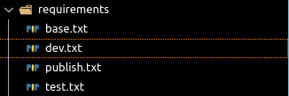

# vscode-requirements

[![Markeetplace Badge][marketplace-badge]][marketplace] [![Install][install-badge]][marketplace] ![Size][size-badge] [![BSD License Badge][license-badge]][license]

pip requirements

## Features

* Support for requirements/*.txt

## Extension Settings

[marketplace]: https://marketplace.visualstudio.com/items?itemName=jankincai.vscode-requirements#review-details
[marketplace-badge]: https://vsmarketplacebadge.apphb.com/version-short/jankincai.vscode-requirements.svg?style=flat-square
[install-badge]: https://vsmarketplacebadge.apphb.com/installs-short/jankincai.vscode-requirements.svg?style=flat-square
[size-badge]: https://img.shields.io/github/languages/code-size/caizhengxin/vscode-requirements
[license]: ./LICENSE
[license-badge]: https://img.shields.io/badge/license-BSD-blue.svg